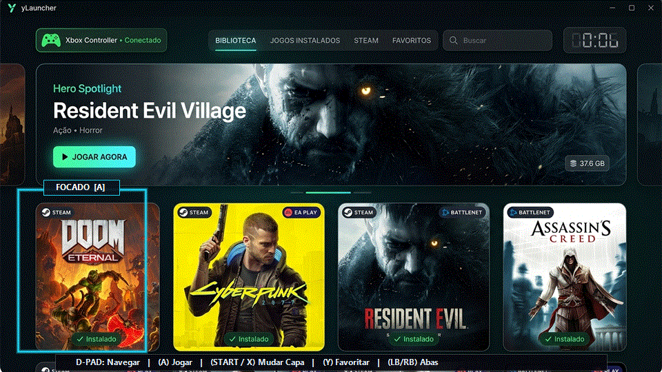
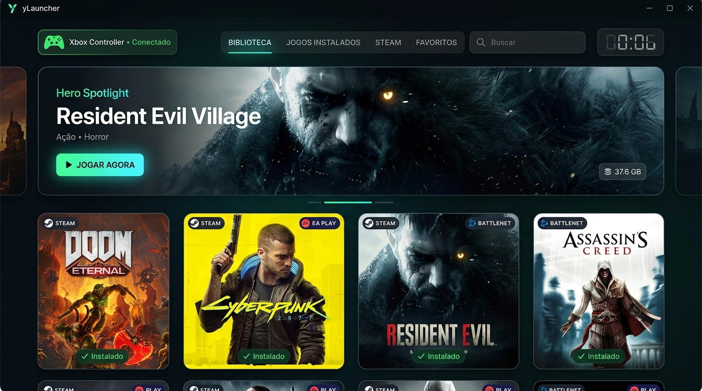
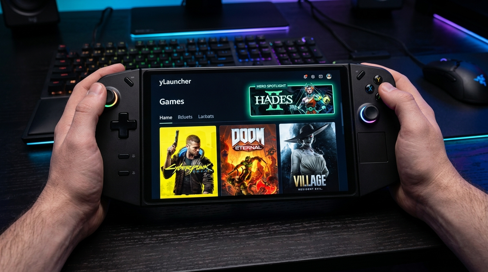

# 🎮 yLauncher

<div align="center">

### **Launcher de Jogos Moderno, Ultra-Leve e Otimizado para Windows 11 e Handhelds**
*Projetado especialmente para Lenovo Legion Go, ASUS ROG Ally, Steam Deck (Windows) e PCs Gamer.*

[-blue?style=for-the-badge&logo=windows)](https://microsoft.com/windows)
[](https://github.com)
[](https://xbox.com)
[](https://amd.com)
[](Instalador_yLauncher.exe)

<br/>



</div>

---

## 📌 Sumário

- [Visão Geral](#-visão-geral)
- [Galeria de Telas](#-galeria-de-telas)
- [Principais Recursos](#-principais-recursos)
- [Como Instalar](#-como-instalar)
- [Mapeamento de Controles](#-mapeamento-de-controles)
- [Compatibilidade](#-compatibilidade)
- [Estrutura do Repositório](#-estrutura-do-repositório)
- [Personalização e Recursos Avançados](#-personalização-e-recursos-avançados)

---

## 🌟 Visão Geral

O **yLauncher** é um inicializador de jogos (game launcher) de alta performance criado para entregar uma experiência cinematográfica estilo console em PCs com Windows 11 e, em especial, consoles portáteis como o **Lenovo Legion Go**, **ASUS ROG Ally**, **Steam Deck** (com Windows) e dispositivos **AYANEO/GPD**.

Construído com tecnologia nativa leve e aceleração de hardware Direct3D, ele garante **inicialização instantânea**, baixo consumo de memória RAM (< 120 MB) e autonomia máxima de bateria para jogatina em dispositivos portáteis.

---

## 📸 Galeria de Telas

| 🖥️ Interface do Launcher (Modo Console) | 🎮 Em Ação no Console Portátil (Legion Go) |
| :---: | :---: |
| [](screenshot_ui.jpg) | [](legion_go_presentation.jpg) |

---

## ✨ Principais Recursos

- 🎮 **Navegação 100% Nativa por Controle (XInput):**
  - Navegação bidimensional matricial 2D inteligente (calculada diretamente com base na resolução e DPI da tela, sem pulos ou desvios diagonais).
  - Algoritmo de zona morta com histerese (*Schmitt Trigger*) para eliminar repiques de comandos e desvios de *stick drift*.
  - Indicador de controle conectado no cabeçalho.
- ⚡ **Otimizado para Handhelds e APUs:**
  - Flags de aceleração Direct3D 11/12 via hardware para máxima fluidez a 60+ FPS no Legion Go e ROG Ally.
- 🔍 **Escaner Automático de Jogos:**
  - Detecta automaticamente títulos instalados da **Steam** (inspeciona manifests `.acf` e bibliotecas `libraryfolders.vdf`), **Epic Games**, **Battle.net**, **EA Play** e jogos locais.
  - Exibe jogos instalados com selo de verificação e tamanho em disco em tempo real.
- 🔤 **Organização Alfabética Natural (A - Z):**
  - Ordenação natural e inteligente por padrão (`Doom`, `Doom 2`, `Doom 64`), considerando caracteres acentuados e números.
  - Filtros rápidos por abas: *Jogos Instalados*, *Steam*, *Battle.net*, *EA Play*, *Locais*, *Favoritos* e *Todos os Jogos*.
- 🎨 **Custom Art Studio (SteamGridDB Integrado):**
  - Troca de capas e pôsteres verticais com 1 botão (`START` no controle ou clique com o botão direito do mouse no jogo).
  - Busca automática de artes em alta definição via SteamGridDB.
- 🖼️ **Destaque Superior Dinâmico (Hero Spotlight):**
  - Backdrop cinematográfico do jogo focado com sinopse, gênero e estatísticas de tamanho.
- 📦 **Instalador Oficial All-in-One Standalone:**
  - Um único arquivo executável portátil que embute tudo o que o launcher precisa.
  - Cria atalhos na Área de Trabalho e Menu Iniciar.
  - Integração nativa ao painel "Aplicativos Instalados" do Windows com desinstalador dedicado.

---

## 🚀 Como Instalar

1. Baixe o executável **[`Instalador_yLauncher.exe`](Instalador_yLauncher.exe)** aqui no repositório.
2. Dê um duplo clique no arquivo baixado:
   - O instalador é 100% autônomo (não necessita de arquivos extras).
   - Escolha o diretório de destino (padrão recomendado: `%LOCALAPPDATA%\yLauncher`).
   - Marque se deseja criar atalho na Área de Trabalho, Menu Iniciar e iniciar com o Windows.
   - Clique em **Instalar Agora**.
3. Pronto! O **yLauncher** será instalado e aberto automaticamente.

> **💡 Dica de desinstalação:** O yLauncher se integra às Configurações do Windows (*Configurações > Aplicativos > Aplicativos Instalados*), podendo ser removido a qualquer momento de forma 100% limpa através do botão Desinstalar do próprio Windows.

---

## 🕹️ Mapeamento de Controles

O yLauncher foi projetado para ser operado 100% pelo controle, sem necessidade de mouse ou teclado.

### 🎮 Controle (Padrão Xbox / Legion Go / XInput)

| Botão | Ação no yLauncher |
| :--- | :--- |
| **D-Pad / Analógico Esquerdo** | Navegação na grade de jogos (Cima, Baixo, Esquerda, Direita) |
| **A** (Botão 0) | **Jogar** / Iniciar jogo selecionado |
| **B** (Botão 1) | **Voltar** / Limpar busca / Alternar para Todos |
| **START** ou **X** (Botões 9 / 2) | **Personalizar Capa** (Abre o Custom Art Studio) |
| **Y** (Botão 3) | **Favoritar** jogo focado (Adiciona / Remove dos Favoritos) |
| **LB / RB** (Botões 4 / 5) | **Alternar Categorias** / Abas da biblioteca |
| **Select / View** (Botão 8) | **Central de Configurações** (Temas, Sons e Opções) |

### ⌨️ Teclado (Atalhos Auxiliares)

| Tecla | Ação |
| :--- | :--- |
| **Setas Direcionais** | Navegação na grade (respeita colunas calculadas em 2D) |
| **Enter** | Iniciar jogo focado |
| **Q / E** | Alternar abas da biblioteca (equivalente a LB / RB) |
| **/** (Barra) | Focar instantaneamente no campo de busca |
| **Esc** | Fechar modal / Fechar visualizador de capas / Sair |

---

## 💻 Compatibilidade

- **Sistemas Operacionais:** Windows 11 (64-bit) e Windows 10 (64-bit versão 1809 ou superior).
- **Consoles Portáteis Testados:**
  - Lenovo Legion Go (modo nativo 144Hz / 8.8" WQXGA)
  - ASUS ROG Ally / ROG Ally X (Z1 / Z1 Extreme)
  - Steam Deck com Windows 10/11
  - GPD Win / AYANEO / OneXPlayer
- **Plataformas de Jogos Suportadas:** Steam, Epic Games Launcher, EA App (EA Play), Battle.net, emuladores e executáveis avulsos `.exe`.

---

## 📁 Estrutura do Repositório

```plaintext
yLauncher/
├── Instalador_yLauncher.exe     # Instalador oficial portátil e autônomo (All-in-One)
├── ylauncher_preview.gif        # Demonstração animada do launcher em ação
├── screenshot_ui.jpg            # Captura de tela em alta definição da interface
├── legion_go_presentation.jpg   # Apresentação do launcher no Lenovo Legion Go
└── README.md                    # Documentação e guia completo do projeto
```

---

## 🎨 Personalização e Recursos Avançados

- **Adicionar Jogos Manuais:**
  - Clique no botão `+ Adicionar Jogo` na barra lateral ou pressione a opção de jogo local para apontar para qualquer executável `.exe` no seu computador.
- **Tamanho dos Cards:**
  - Alterne entre os modos **Normal** e **Capas Grandes (HD)** usando o botão de tamanho na barra superior.
- **Resolução e Escala no Legion Go / ROG Ally:**
  - O yLauncher é 100% responsivo e possui suporte nativo a Per-Monitor DPI Aware v2. Quer você use resolução 1280x800, 1920x1080 ou 2560x1600 com qualquer fator de escala (100%, 125%, 150%, 200%), a grade se ajustará perfeitamente à tela sem distorções.

---

<div align="center">
  <sub>Criado com foco em desempenho, fluidez e liberdade para gamers de PC e consoles portáteis.</sub>
</div>
